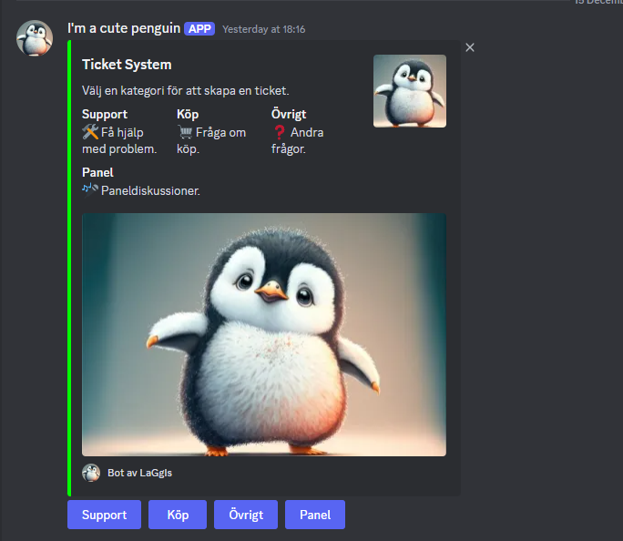

# Discord Ticket Bot

A feature-rich Discord bot for managing support tickets with multiple categories and MySQL database integration.



## Features

- **Multiple Ticket Categories:**
  - Support
  - Purchase (Köp)
  - Other (Övrigt)
  - Panel

- **Ticket Management:**
  - Create tickets with unique IDs
  - Automatic category-based channel creation
  - Ticket status tracking
  - Ticket closing functionality
  - Ticket transcripts
  - Support for custom descriptions

- **Database Integration:**
  - MySQL database for persistent ticket storage
  - Tracks ticket status, creators, and details

- **Role-Based Access:**
  - Support role management
  - Permission-based command access

## Prerequisites

- Node.js (v16.9.0 or higher)
- MySQL Server
- Discord Bot Token
- Discord Server with appropriate permissions

## Dependencies

- discord.js: ^14.16.3
- mysql2: ^3.11.4
- uuid: ^11.0.3

## Installation

1. Clone the repository:
```bash
git clone https://github.com/yourusername/Discord-Ticket-bot.git
cd Discord-Ticket-bot
```

2. Install dependencies:
```bash
npm install
```

3. Set up your MySQL database:
- Create a database named 'discordbot'
- Import the provided `Ticket.sql` file

4. Configure the bot:
- Open `Ticketbot.js`
- Replace the following values:
  - Bot token
  - Channel IDs
  - Category IDs
  - Support role ID
  - MySQL connection details

## Usage

1. Start the bot:
```bash
node Ticketbot.js
```

2. The bot will create a ticket panel in the specified channel where users can:
- Create tickets by category
- View ticket status
- Close tickets when resolved

## Commands

- `!close` - Close a ticket
- Additional commands for ticket management and configuration

## Contributing

1. Fork the repository
2. Create your feature branch (`git checkout -b feature/AmazingFeature`)
3. Commit your changes (`git commit -m 'Add some AmazingFeature'`)
4. Push to the branch (`git push origin feature/AmazingFeature`)
5. Open a Pull Request

## License

This project is licensed under the MIT License - see the LICENSE file for details.

## Support

For support, please create an issue in the GitHub repository or contact the maintainers.
